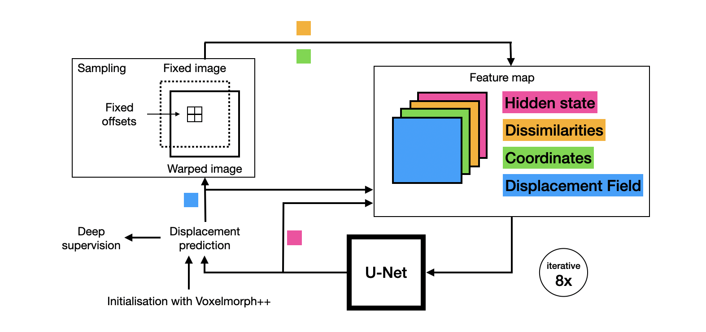

# Learn2Optimise
Learning iterative optimisation for deformable image registration of lung CT with recurrent convolutional networks

A fully deep learning-based approach that aims to emulate the structure of gradient-based optimisation as used in conventional registration and thus learns how to optimise. 


# Architecture



We emulated different multiple parts of conventional optimisation-based image registration with deep learning counterparts. Iterative updates of the displacement prediction through the recurrent network work similar to iterative gradient descent. The model is given just enough information to compute gradients, namely coordinates and cost function for dynamically sampled displacements. To ensure every iteration aims to reduce displacement costs, deep keypoint supervision (with increased weighting for each consecutive iteration) is employed. To provide the network with the possibility to determine each update step in dependence of previous steps (like e.g. Adam optimisation with first and second momentum), unsupervised hidden states are propagated through the network.

# Evaluation on intra-patient lung CT
We trained our model on a total of 30 ex- and inspiratory lung CT scans (10 cases from the DIR-Lab COPDgene, DIRLab 4DCT and EMPIRE10 datasets each) and evaluated on COPDgene and 4DCT data in a 5-fold cross-validation.

Training can be performed by running
```
python learn2optimise_3dall_folds.py {fold}
```

Without deformable pre-registration, our model outperforms Adam optimisation in regards to target registration error, smoothness and plausabiliy of the displacement fields. As observed in the Learn2Reg 2021 challenge, deep learning-based approaches seem to rely on instance optimisation to achieve comparable performance to state-of-the-art conventional registration. After pre-registration with Voxelmorph++, our model and Adam optimisation achieved comparable results.
